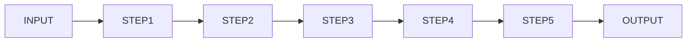

# ⚙️ *FPGA  VHDL  LaneDetection* · HW Accelerator

[](LICENSE)  

[](#hardware)  

[](#vhdl-modules)  


## Overview

*This repo implements lane detection on FPGA using hardware provided by [FPGA Vision Remote Lab](https://fpga-vision-lab.h-brs.de/weblab/login). The main VHDL modules perform streaming image processing including edge detection, gradient computation, line buffering, and video synchronization. C programs read BMP images from the `test_images` folder to generate simulation inputs and run reference models for comparison. Testbenches and memory initialization files help validate the design in simulation (ModelSim) and on FPGA hardware (Intel Quartus Prime).*

---

## Repo ~ Structure

```
LaneDetection_FPGA/
├── c-files/                 # Software utilities for FPGA verification:
│                              - Includes stimulus generators that convert BMP images to simulation input
│                              - Reference lane detection models (fixed-point and floating-point) for result comparison
│                              - Output converters to visualize FPGA results as BMP images
├── constraints/             # FPGA pin/timing constraints (.qsf and .sdc files)
├── docs/                    # Lecture slides and PDFs from FPGA-Vision
├── mem/                     # Memory initialization files (.mif, .ods)
├── src/                     # VHDL source files (top-level and module files)
├── test_images/             # Input images and expected output for verification
├── testbench/               # VHDL testbenches for simulation and verification
└── README.md                # Project documentation
```

---

## Project Flowchart



*For detailed architecture, see `/docs`*

---


## VHDL Modules

| Module                 | Functionality                  |
|------------------------|--------------------------------|
| `top_lane.vhd`         | Integrates all modules          |
| `lane_sobel.vhd`       | Sobel edge detection           |
| `lane_g_matrix.vhd`    | 3x3 convolution for gradient   |
| `lane_linemem.vhd`     | Stores pixel lines for convolution   |
| `lane_sync.vhd`        | Timing & sync signals    |
| `lane_g_root_IP.vhd`   | ROM IP for square root         |
| `sim_lane.vhd`         | Testbench for simulation       |

---

## References

- [FPGA Vision Remote Lab](https://github.com/Marco-Winzker/FPGA-Vision)
- [IEEE 1076 VHDL Standard](https://ieeexplore.ieee.org/document/954909)

---

For suggestions or contributions, please open a discussion or pull request.

