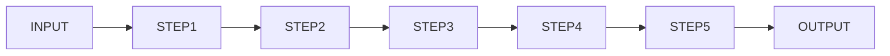

# ⚙️ *FPGA  VHDL  LaneDetection* · HW Accelerator

[](LICENSE)  

[](#hardware)  

[](#vhdl-modules)  


## Overview

*This repo implements lane detection on FPGA using hardware provided by [FPGA Vision Remote Lab](https://fpga-vision-lab.h-brs.de/weblab/login). The main VHDL modules perform streaming image processing including edge detection, gradient computation, line buffering, and video synchronization. C programs read BMP images from the `test_images` folder to generate simulation inputs and run reference models for comparison. Testbenches and memory initialization files help validate the design in simulation (ModelSim) and on FPGA hardware (Intel Quartus Prime).*

---

## Repo ~ Structure

```
LaneDetection_FPGA/
├── c-files/                 # Software utilities for FPGA verification:
│                              - Includes stimulus generators that convert BMP images to simulation input
│                              - Reference lane detection models (fixed-point and floating-point) for result comparison
│                              - Output converters to visualize FPGA results as BMP images
├── constraints/             # FPGA pin/timing constraints (.qsf and .sdc files)
├── docs/                    # Lecture slides and PDFs from FPGA-Vision
├── mem/                     # Memory initialization files (.mif, .ods)
├── src/                     # VHDL source files (top-level and module files)
├── test_images/             # Input images and expected output for verification
├── testbench/               # VHDL testbenches for simulation and verification
└── README.md                # Project documentation
```

---

## Project Flowchart


```mermaid
flowchart LR
    Vin[INPUT] --> S[STEP1]
    S --> K[STEP2]
    K --> G[STEP3]
    G --> B[STEP4]
    B --> T[STEP5]
    T --> Vout[OUTPUT]
```

*For detailed architecture, see `/docs`*

---


### Stimulus Generation from `/c-files`

1. **Clone the repository**
   ```bash
   git clone https://github.com/mkfahim/fpga-vhdl-lane-detection-hw.git
   ```
2. **Navigate to the C source directory**

   ```bash
   cd <path-to-cloned-repo>/c-files
   ```
> Replace `<path-to-cloned-repo>` with the path to the folder created when you cloned the repository.

3. **Compile the main C testbench**

   ```bash
   gcc -o lane_testbench.exe lane_testbench.c
   ```

4. **Run the testbench on sample images**

   ```bash
   ./lane_testbench.exe ../test_images/street_A
   ./lane_testbench.exe ../test_images/street_B
   ./lane_testbench.exe ../test_images/street_C
   ```
5. **Observe the generated files**
   For each input image, the testbench produces **three files**:

   | Input Image         | Generated Files                                         | Description |
   |--------------------|--------------------------------------------------------|-------------|
   | `street_A.bmp`      | `street_A_edge_fixed.bmp`                              | Edge-detected output (fixed-point) |
   |                     | `street_A_stimuli.txt`                                 | Simulation input file for VHDL testbench |
   |                     | `street_A_expected.txt`                                | Reference output for verification |


**Next steps**
- Use the generated `.txt` files as **input memory** for your VHDL simulation (`sim_lane.vhd`)  
- Optionally, use `sim2bmp.c` to convert VHDL simulation outputs back to `.bmp` images for visual verification


---

## References

- [FPGA Vision Remote Lab](https://github.com/Marco-Winzker/FPGA-Vision)
- [IEEE 1076 VHDL Standard](https://ieeexplore.ieee.org/document/954909)

---

For suggestions or contributions, please open a discussion or pull request.


